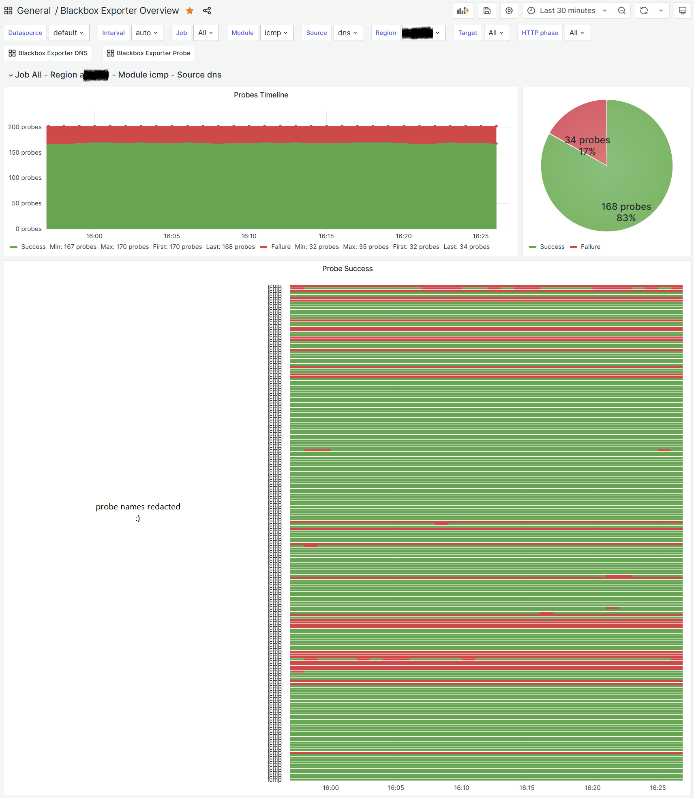

# Background story
Back when I ran SCOM, in addition of Windows machine monitoring and Event Log aggregation, it was performing a duty of ping testing all the servers in my environment. This was a very useful feature as it allowed me to quickly identify servers that were down or unreachable. The main quirk was that it was only aware of the servers that I manually added and not able to discover things automatically as I didn't have the right setup to leverage the SNMP based discovery.

Fast forward, I deployed [Uptime Kuma](https://github.com/louislam/uptime-kuma) after SCOM's decomissioning to allow me to continue being being able to quickly check the status of my environment's most important components. However, similarly to SCOM, it had the same limitation of having to manually add all targets of interest.

I needed something more dynamic and I came across the [Blackbox Exporter](https://github.com/prometheus/blackbox_exporter) for Prometheus. This is a very powerful tool that allows you to probe endpoints and expose the results in a format that Prometheus can scrape. This is exactly what I needed to replace the functionality of SCOM and Uptime Kuma - still, I didn't know how to dynamically discover the targets.

This is a good moment to mention that a couple of months ago I didn't know anything about Prometheus and I was still learning the basics. Initially, I deployed Blackbox Exporter with a static list of targets to probe, but as my skills in Prometheus improved; I quickly realized that I can leverage the service discovery components to dynamically discover the targets.

The built in SD features in Prometheus allow for various types of discovery, such as Kubernetes, Docker, Consul, etc. However, [DNS Service Discovery](https://prometheus.io/docs/prometheus/latest/configuration/configuration/#dns_sd_config) was not what I wanted, as this would essentially work by resolving provided hostnames to IPs as mentioned in the above linked documentation.

> This service discovery method only supports basic DNS A, AAAA, MX and SRV record queries, but not the advanced DNS-SD approach specified in RFC6763.

# The idea
This is where the idea to leverage the DNS Zone Transfer feature to dynamically discover the targets was born. I realized that I was able to write a simple script to perform a zone transfer and output it in the JSON format that Prometheus SD can consume.

The format looks like this:

```json
[
  {
    "targets": [ "<host>", ... ],
    "labels": {
      "<labelname>": "<labelvalue>", ...
    }
  },
  ...
]
```

# The dns2promsd script

I went ahead and proceeded with Python to write this script. I used the [dnspython](https://www.dnspython.org/) library to perform the zone transfer and [Flask](https://flask.palletsprojects.com/) to host the web server. I also added Prometheus metrics to the script to allow for monitoring of the script itself.

The script is available on [GitHub](https://github.com/mateuszdrab/dns2promsd) - there's no container image, it's something I need to publish but I haven't explored GitHub Actions and GHCR yet so it's on my To-Do list as I'd prefer not to use DockerHub.

The script launches a webserver at port `5000` and takes some arguments, most notably `zone` and `nameserver`. This requires the destination nameserver to allow unauthenticated zone transfers to the host where the script runs.

With the below Prometheus scrape config, you can ICMP probe each discovered A record from the desired zone:

```
- job_name: "blackbox-exporter-icmp-from-dns"

  metrics_path: /probe
  params:
    module: [icmp]

  http_sd_configs:
    - url: http://dns2promsd.default:5000/discover?zone=domain.local&nameserver=1.2.3.4

  relabel_configs:
    - source_labels: [__meta_record_name]
      target_label: target
      replacement: "${1}"
    - source_labels: [__address__]
      target_label: __param_target
    - source_labels: [__param_target]
      target_label: instance  
    - source_labels: [__param_module]
      target_label: target_module  
    - source_labels: [__meta_record_txt_blackbox_severity]
      target_label: alert_severity
    - regex: __meta_record_txt(.*)
      action: labeldrop          
    - action: labelmap
      regex: __meta_record_(.+)
      replacement: record_${1}

    - target_label: __address__
      replacement: blackbox-exporter.default:9115
```

The above config will scrape the `/probe` endpoint of the Blackbox Exporter and pass the discovered targets as the `target` parameter. The `target_module` parameter is used to specify the module to use for probing, it can be overridden if needed and can even be sourced from a DNS TXT record with the same name as the A record (more on that later). In this case, I'm using the default `icmp` module to perform ICMP pings.

# TXT records for extra metadata
The script automatically exposes meta fields named `__meta_record_txt_<key>` for each discovered record and sources the name and value from the TXT record. The TXT record itself needs to be in a key=value format. Multiple records can be specified by separating them with a colon.

I utilize those records to override the module, the desired alert severity for the specific target (based on a modifired Prometheus alerting rule) and also to disable monitoring of some targets. 

# Alerting rule

My Prometheus ping alert rule looks like this and uses the above TXT record to allow for per target alert severity override.

```yaml
- alert: BlackboxProbeFailed
  expr: "probe_success == 0"
  for: 5m
  labels:
    severity: >-
      {{ if $labels.alert_severity }}{{$labels.alert_severity}}{{else}}critical{{end}}
  annotations:
    summary: Blackbox probe failed (instance {{ $labels.instance }})
    description: "Probe failed"
```

# The Grafana Dashboard

For dashboarding purposes, I use a heavily modified (reinvented?) version of [this](https://grafana.com/grafana/dashboards/14928-prometheus-blackbox-exporter/) dashboard. Beware that with ICMP, most of the panels don't populate; however, the most important data (probe success and latency) are there and you can use the new state timeline component to generate really nice uptime overview dashboard.



With this in place, you can enjoy the benefits of dynamic discovery of targets and also have the ability to override the module to use for probing and the alert severity for each target. 

It's like Blackbox Exporter is on steroids!