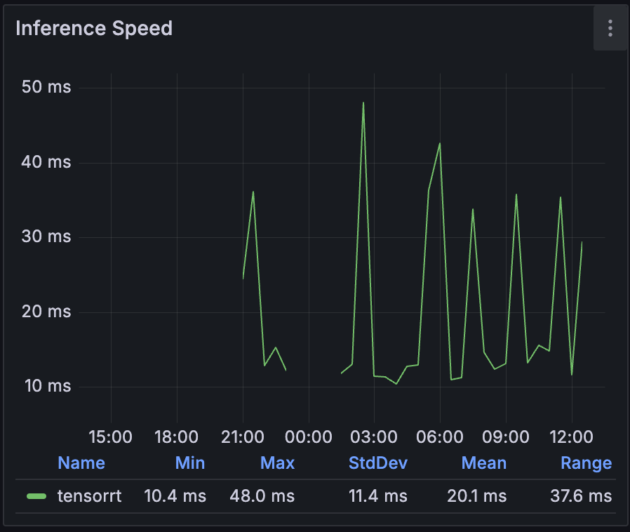

I have just received an NVIDIA Tesla P40 having sourced it for a decent price with the intent of installing it into my Hyper-V server.
It's an older card, but it's still a beast with 24GB of memory and 3840 CUDA cores.
The card is gaining popularity in the AI community due to its high memory capacity and relatively low price, it is also passively cooled and an official HPE optional product (according to HPE DL380 G9 specs) and is therefore recognized by iLO and it's temperature can be monitored as well.

I had a plan in my head to get hardware acceleration working for a number of components in my lab which currently are:

- Jellyfin (to enable hardware assisted transcoding)
- Frigate (hardware accelerated decoding and encoding plus TensorRT for object detection)
- Windows 11 VM (3D rendering acceleration in RDP sessions)
- Ollama (for small AI/LLM models and experiments)
- Piper/Whisper (speech-to-text and text-to-speech for Home Assistant)

The above is quite a list, and as you could imagine, just as the GPU arrived, I was only aware of one definitive method of making this work in Hyper-V - Discrete Device Assignment (DDA). However, I did not want to uniqely dedicated the card to one VM and even if it was, it would either have to be a Windows VM with WSL2 installed to allow meeting the above use cases or potentially, exploring some form of GPU partitioning.

Windows Server 2025 comes with [GPU partitioning](https://learn.microsoft.com/en-us/windows-server/virtualization/hyper-v/gpu-partitioning) as a new feature, but I came across lots of articles online that suggested that it was possible to do this with Hyper-V earlier versions of Windows Server. I was also curious to understand how WSL2 was able to utilize a GPU of the host.

Turns out, GPU paravirtualization is thing and is a technology created by Microsoft to enable sharing of a GPU into VMs. This is because both WSL2 and Windows Sandbox are special kind VMs which sit on top of Windows Hypervisor Platform. This is achieved in cooperation with the GPU drivers that enable the VMs to access the host's GPU via vmbus. This approach is really performant and allows processes from multiple virtual machines to compete for the GPU resources as if they were running on the same machine.

There are various security concerns of such apprach due to lack of isoltion at GPU level making this approach potentially unsitable for corporate use; however, I consider them out of scope of this article and sutable for my use as this is my own environment with no multitenancy. There are other partitioning technologies like NVIDIA MIG and vGPU which are more suitable for corporate uses where virtualization and proper resource isolation is required. Those thechnologies are licensed and require a compatible GPU.

This technology only works with drivers in WDDM mode and not in TCC mode, which is the case for most consumer GPUs but for me it turned out to be a problem as the P40 is a Tesla card and is in TCC mode by default and switching modes proved to be a challenge which deserves a separate post. Currently, I'm running the Grid driver version 16.9 (539.19), the last version of the GRID driver that supports the P40. Version 17.0 and later do not support the P40.

Microsoft and NVIDIA brought support for CUDA, DirectX compregended with NVIDIA Container Toolkit allowing Docker and other container runtimes to take advantage of the GPU as if it was a real one. From the workload's perspective, it's not aware that it's using a paravirtualized GPU but it can be acutally easily distinguised as the PCI device ID is different from the real one.
On Linux, `lspci -v` shows the below for my P40, pay attention the device is seen as a Microsoft Basic Render Driver and not as an NVIDIA Device and uses a special kernel module `dxgkrnl`, this module is baked into the WSL2 kernel but it's not in the mainline kernel.

```text
e540:00:00.0 3D controller: Microsoft Corporation Basic Render Driver
        Physical Slot: 2013314316
        Flags: bus master, fast devsel, latency 0, NUMA node 0
        Capabilities: [40] Null
        Kernel driver in use: dxgkrnl
        Kernel modules: dxgkrnl
```

Turns out getting that to work on Ubuntu was a little bit more complicated than I expected. I navigated through a few online tutorials with steps provided to compile a DKMS module on top of WSL2s kernel, but I was not able to get it to work. After all this effort, it turned out the cause was missing shared objects and wasn't anything with the kernel module itself. Until I got it to work, the output of `nvidia-smi` was showing the below:

```text
Failed to initialize NVML: GPU access blocked by the operating system
Failed to properly shut down NVML: GPU access blocked by the operating system
```

In an effort to better understand what's going on, I raised an [issue](https://github.com/seflerZ/oneclick-gpu-pv/issues/8) under one of the repositories which provided a script for the DKMS module installation. Eventually, it turned out that the files which need to be copied from the host to the Ubuntu VM are located in multiple directories and other scripts didn't account for that. There potentially was a change at some point that changed the distribution of the files:

- `C:\Windows\System32\lxss\lib` - those files are provided by the GPU driver on the host
- `C:\Program Files\WSL\lib` - those files are provided by WSL2 as the shared objects there are driver version independent, currently it seems to have the D3D12 libraries as well as libdxcore.so which is why `nvidia-smi` was failing before.

> The NVIDIA runtime library (libnvidia-container) can dynamically detect libdxcore and use it when it is run in a WSL 2 environment with GPU acceleration.

libdxcore is a library which enables detection and interfacing with GPUs, without it, the paravirtualized GPU was not detectable.

Anyways, the files from the above folders need to be placed at `/usr/lib/wsl/lib` respectively and the Windows NVIDIA driver from `C:\Windows\System32\DriverStore\FileRepository\nv_dispi.inf_amd64_...` needs to be copied to `/usr/lib/wsl/drivers` as well. After that, the DKMS module can be [compiled](https://github.com/staralt/dxgkrnl-dkms/blob/main/install.sh) and installed and the GPU can be used in WSL2.

I have streamlined all those steps so that they can be ran in a single script and I have published it my fork of hyperv-vm-provisioning on [GitHub](https://github.com/mateuszdrab/hyperv-vm-provisioning) in the `Copy-HostGPUDriverToUbuntu.ps1` script. This script assumes that passwordless authentication is possible to the VM and that the user is root. You can set the `GpuInstallScriptArgs` parameter to `--install-docker` to have the script install Docker and NVIDIA Container Toolkit as well. I suggest adding `ShowVmConnectWindow` parameter to `$true` to see show the VM console after reboot. In secureboot systems, the script will start a MOK key enrollment process which requires user interaction.

## Does it work?

### Frigate

It certainly seems to, I run two Docker instances of Frigate on a dedicated VM. CPU usage of FFmpeg is relatively low and the GPU is being utilized according to `nvidia-smi`. Object detection using TensorRT is also working as expected although not as fast as with the Coral.

Frigate [specifies](https://docs.frigate.video/configuration/hardware_acceleration#nvidia-gpus) that driver version 570.0 is required due to FFmpeg's Video Codec SDK version 13.0.19 dependency. Just a few days ago, the minimum version was 550.0 and the SDK was at 12.0.16, so it seems that the requirements are constantly changing.

Frigate is currently pinned to [FFmpeg 5.1-2](https://github.com/FFmpeg/FFmpeg/releases/tag/n5.1.2) as of [version 0.14.1](https://github.com/blakeblackshear/frigate/discussions/11240).
I've chirped in on that discussion as it appears the documentation is a bit misleading pointing to codec requirements of current FFmpeg version but using an older one.
Frigate 0.15 will bump FFmpeg to version 7.0, previous version can still be ran by adding

```yaml
ffmpeg:
  path: "5.0"
```

to the configuration file according to the [release notes](https://github.com/blakeblackshear/frigate/releases/tag/v0.15.0-rc2).

In the future, I may have to use older builds of FFmpeg after it's updated to a newer one.

#### GPU usage

About 4GB of P40s 24GB of memory is being utilized.

```text
+---------------------------------------------------------------------------------------+
| NVIDIA-SMI 535.230.02             Driver Version: 539.19       CUDA Version: 12.2     |
|-----------------------------------------+----------------------+----------------------+
| GPU  Name                 Persistence-M | Bus-Id        Disp.A | Volatile Uncorr. ECC |
| Fan  Temp   Perf          Pwr:Usage/Cap |         Memory-Usage | GPU-Util  Compute M. |
|                                         |                      |               MIG M. |
|=========================================+======================+======================|
|   0  Tesla P40                      On  | 00000000:84:00.0 Off |                    0 |
| N/A   48C    P0              45W / 250W |   3593MiB / 23040MiB |      1%      Default |
|                                         |                      |                  N/A |
+-----------------------------------------+----------------------+----------------------+

+---------------------------------------------------------------------------------------+
| Processes:                                                                            |
|  GPU   GI   CI        PID   Type   Process name                            GPU Memory |
|        ID   ID                                                             Usage      |
|=======================================================================================|
|    0   N/A  N/A       471      C   /python3.9                                N/A      |
|    0   N/A  N/A       483      C   /python3.9                                N/A      |
|    0   N/A  N/A       540      G   /ffmpeg                                   N/A      |
|    0   N/A  N/A       554      G   /ffmpeg                                   N/A      |
|    0   N/A  N/A       562      G   /ffmpeg                                   N/A      |
|    0   N/A  N/A       615      G   /ffmpeg                                   N/A      |
|    0   N/A  N/A       618      G   /ffmpeg                                   N/A      |
|    0   N/A  N/A       624      G   /ffmpeg                                   N/A      |
|    0   N/A  N/A       632      G   /ffmpeg                                   N/A      |
|    0   N/A  N/A       648      G   /ffmpeg                                   N/A      |
|    0   N/A  N/A       658      G   /ffmpeg                                   N/A      |
|    0   N/A  N/A       918      G   /ffmpeg                                   N/A      |
|    0   N/A  N/A       920      G   /ffmpeg                                   N/A      |
+---------------------------------------------------------------------------------------+
```

The `Type` field indicates:

- C - Compute Process
- G - Graphics Process
- C+G - Compute/graphics Process

Metrics indicate that inference speed is between 10-50ms, the PCIe Coral would usually not raise over 20ms.



### Jellyfin, Ollama

Have been tested and work, I will provide more details in the future after I deploy GPU nodes in my K3s based Kubernetes cluster.

### Piper/Whisper

I have not yet tested those.

## What about Windows?

It's much easier, all you need to do is add the GPU to the VM run the [this script](https://gist.github.com/neggles/e35793da476095beac716c16ffba1d23#file-new-gpupdriverpackage-ps1) on the host. It will create an archive with the current driver files that need to be extracted at `C:\Windows\` on the VM. After that, the GPU can be used in the VM. I have included this script in my fork of hyperv-vm-provisioning as well. It is important to not try to install the standard GPU driver inside the VM as forcing the installation by manually selecting the INF file will result in a BSOD.

References:

- [GPU compute within Windows Subsystem for Linux 2 supports AI and ML workloads](https://techcommunity.microsoft.com/blog/educatordeveloperblog/gpu-compute-within-windows-subsystem-for-linux-2-supports-ai-and-ml-workloads/1526002)
- [Leveling up CUDA Performance on WSL2 with New Enhancements](<https://developer.nvidia.com/blog/leveling-up-cuda-performance-on-wsl2-with-new-enhancements/>)
- [Announcing CUDA on Windows Subsystem for Linux 2](<https://developer.nvidia.com/blog/announcing-cuda-on-windows-subsystem-for-linux-2>)
- [staralt/dxgkrnl-dkms DKMS kernel module install script](https://github.com/staralt/dxgkrnl-dkms)
- [seflerZ/oneclick-gpu-pv](https://github.com/seflerZ/oneclick-gpu-pv)
- [Hyper-V GPU Passthrough: An Essential Guide for Beginners](https://www.nakivo.com/blog/hyper-v-gpu-passthrough)
- [Configuring GPU-PV on Hyper-V](https://gist.github.com/neggles/e35793da476095beac716c16ffba1d23)
- [Frigate Hardware Acceleration](https://docs.frigate.video/configuration/hardware_acceleration#nvidia-gpus)
- [[Question]: Why is the ffmpeg version pinned at n5.1-2, a build from 2022-07-31? #11240](https://github.com/blakeblackshear/frigate/discussions/11240)
