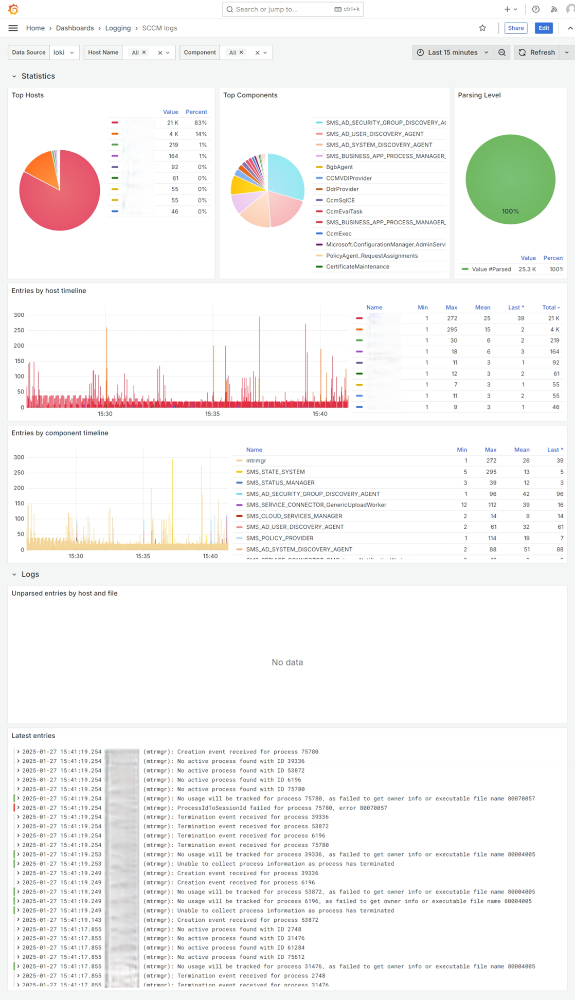

System Center Configuration Manager (SCCM) is still in use in my lab, mostly as a means of deployment of applications and updates. Whilst I'm working on moving some of the functionality into Intune, SCCM will remain for forseeable future the update orchestrator for my server environment.

SCCM logs seem to be standardized around two formats.
Here are the examples of them:

`Service is up and running.~~  $$<SMS_REST_PROVIDER><01-26-2025 17:35:20.122+00><thread=13372 (0x343C)>`

`<![LOG[Worker M365ADeploymentPlanWorker was triggered by timer.]LOG]!><time="00:02:06.5649051" date="12-20-2024" component="SMS_SERVICE_CONNECTOR_M365ADeploymentPlanWorker" context="" type="1" thread="126" file="">`

The flow below is my current configuration, each step of the process will be explained in comments above the stage.

## The flow

The `local.file_match` stage discovers all files ending with .log in both `C:/Windows/CCM/Logs` (SCCM agent) and `C:/Program Files/Microsoft Configuration Manager/Logs` (SCCM server) directories, and tag them with "sccm" app label.
The files are then processed by `loki.process` stage which is the most critical stage in this flow comprised of the following steps.

It may be noticed that some expressions are escaped, this is due to the fact that the expressions are within a double quoted string. Some expressions are also surrounded by backticks, in this case they do not need to be escaped. Spaces from the expressions have been replaced by `\s` for ease of reading.

- `stage.drop` - drops the files whose names match the expression `.+repair-msi-.+\.log` and `.+-\d+-\d+\.log` as they are not relevant to the SCCM logs. The first match is for the logs generated by the SCCM repair MSI process and the second match is for the SCCM log files that have been rotated.
Those files would have been ingested already before renaming. Additionally, the logs would be so old that they would most likely would not be accepted by Loki (depending on the configuration).
In my case, the configuration is 1 hour and it is enforced at both Loki server side and client side in my standard log processing steps (which are not shown here but are referenced as `loki.relabel.file.receiver`).
- `stage.match` - this is the first match stage that matches the logs that contain the `$$<` string preceeded by two spaces using expression `\s\s\$\$<` (from the first log  line example). This is the format of the SCCM logs generated by the SCCM server, I've not seen this format on SCCM agents. The logs are then processed by the`stage.regex` stage which extracts the `component` and `datetime` labels from the lines. This extraction is done by the expression `\s\s\$\$<(?P<component>[^>]+)><(?P<datetime>[^>]+)>`
- `stage.match` - the second match stage that matches lines which the first stage did not. The processing flow is a bit more complicated as we have to extract `date` and `time` separately from the fields and then, construct a `datetime` label that will be processed for the timestamp. Before this is done, the multiline stage is employed as those kind of logs my span across multiple lines. This specific setup works because I rely on the fact I've not seen the two different log format share the same log file. The main expression to match the line content is `\]LOG\]!><time="(?P<time>[^"]+)" date="(?P<date>[^"]+)" component="(?P<component>[^"]+)"`. The `stage.template` stage is then used to construct the `datetime` label from the `date` and `time` labels.
- `stage.drop` - drops the logs that have an empty `component` label. The `drop_counter_reason` is set to `empty_component_label` for the logs that are dropped. This stands to prevent logs where the regex did not succeed from being ingested.
- `stage.timestamp` - this stage takes care of parsing the timestamps which have been observed to come in various formats. In each case, the timestamps seem to be UTC or include the timezone offset.
- `stage.labels` - this stage preserves the `component` extracted label. By default, extracted labels would not be added to the logs entry.
- from this point, the logs are forwarded to the next stage in the flow which is `loki.relabel.file.receiver` and follow my standard ingestion flow. This flow is documented in the [Ingesting logs into Loki](/article/ingesting-logs-into-loki) article.

```
local.file_match "sccm" {
  path_targets = [
    {__path__ = "C:/Windows/CCM/Logs/*.log", "app" = "sccm"},
    {__path__ = "C:/Program Files/Microsoft Configuration Manager/Logs/*.log", "app" = "sccm"},
  ]
  
  sync_period  = "600s"
}

loki.source.file "sccm" {
  forward_to = [ loki.process.sccm.receiver ]
  targets    = local.file_match.sccm.targets
}

loki.process "sccm" {
  forward_to = [ loki.relabel.file.receiver ]

  stage.drop {
    source = "filename"
    expression = `.+-\d+-\d+\.log|.+repair-msi-.+\.log`
  }

  stage.match {
    selector = `{app="sccm"} |~ "  \\$\\$<"`

    stage.regex {
      expression = `  \$\$<(?P<component>[^>]+)><(?P<datetime>[^>]+)>`
    }
  }

  stage.match {
    selector = `{app="sccm"} !~ "  \\$\\$<"`

    stage.multiline {
      firstline  = `^<!\[LOG\[`
      max_lines  = 1024
    }

    stage.regex {
      expression = `\]LOG\]!><time="(?P<time>[^"]+)" date="(?P<date>[^"]+)" component="(?P<component>[^"]+)"`
    }

    stage.template {
      source   = "datetime"
      template = "{{ .date }} {{ .time }}"
    } 
  }

  stage.drop {
    source = "component"
    expression = `^$`
    drop_counter_reason = "empty_component_label"
  }

  stage.timestamp {
    source = "datetime"
    format = "01-02-2006 15:04:05.000-07"
    fallback_formats = [
      "1-2-2006 15:04:05.000", 
      "01-02-2006 15:04:05.000", 
      "1-2-2006 15:04:05.0000000", 
      "01-02-2006 15:04:05.0000000",
    ]
    location = "Etc/UTC"
  }

  stage.labels {
    values = {
      component  = "",
    }
  }
}
```

As usual, ingesting logs and not visualizing them would be a shame. I've created a dashboard that takes care of some basic visualization of the collected logs.



Now I can go back to troubleshooting the SCCM DP issues...

Source code of the dashboard is available [here](dashboard.json).
